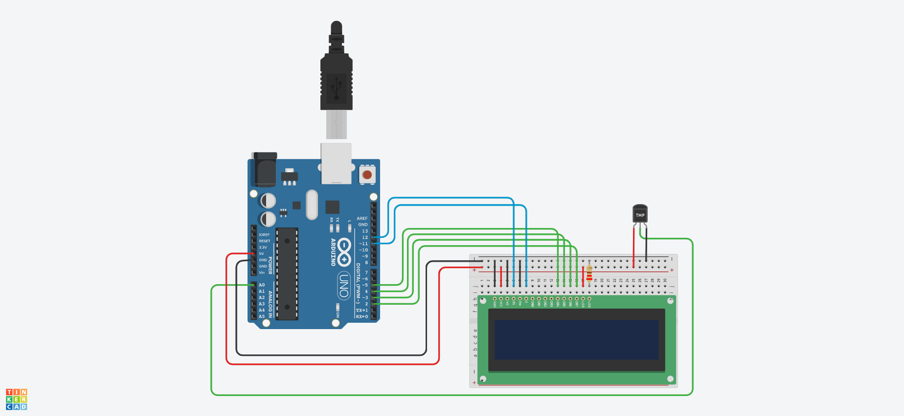

# Arduino Sensor Temperature (TMP36)

Arduino Uno connected to a sensor temperature (TMP36) and a LCD

# Components

* 1 Arduino Uno R3
* 1 Temperature Sensor TMP36
* 1 LCD 16 x 2
* 1 Resistors 220Ω

# Circuit

Once the Arduino is connected it will read the temperature from the sensor and the value will be showed in the LCD

# Code

The code for Arduino can be found in the `src` directory. It's just a single file written in `C`.

# Simulation

[watch how it works in tinkercad](https://www.tinkercad.com/things/aSBxGpCYfHv)
